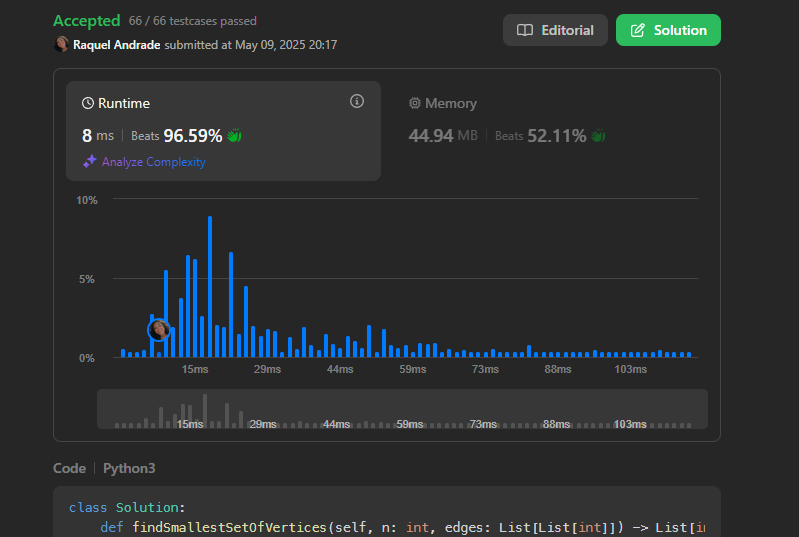
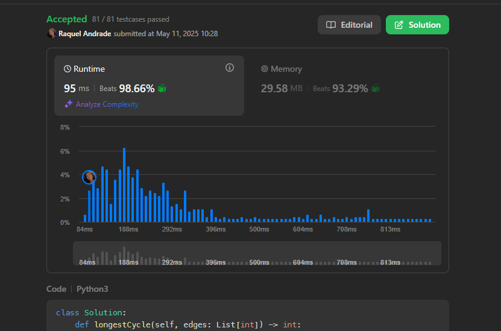

# Grafos 2 - LeetCode

**Número da Lista**: X  
**Conteúdo da Disciplina**: Grafos 2 

## Alunos
|Matrícula | Aluno |
| -- | -- |
| 211062437 |  Raquel Ferreira Andrade |
| -  |  - |

## Sobre 
Repositório destinado a resolução de problemas do LeetCode, envolvendo os conceitos estudados em sala de aula do conteúdo de Grafos 2. 

| Problema | Dificuldade | Resolução |
| -- | -- | -- |
| [1557. Minimum Number of Vertices to Reach All Nodes](https://leetcode.com/problems/minimum-number-of-vertices-to-reach-all-nodes/description/) | Média | [Resolução](/code/1557.py) |
| [2360. Longest Cycle in a Graph](https://leetcode.com/problems/longest-cycle-in-a-graph/description/) | Difícil | [Resolução](/code/2360.py) |
| [2699. Modify Graph Edge Weights](https://leetcode.com/problems/modify-graph-edge-weights/description/) | Difícil | [Resolução](/code/2699.py) |

## Screenshots

## Instalação 
**Linguagem**: Python
